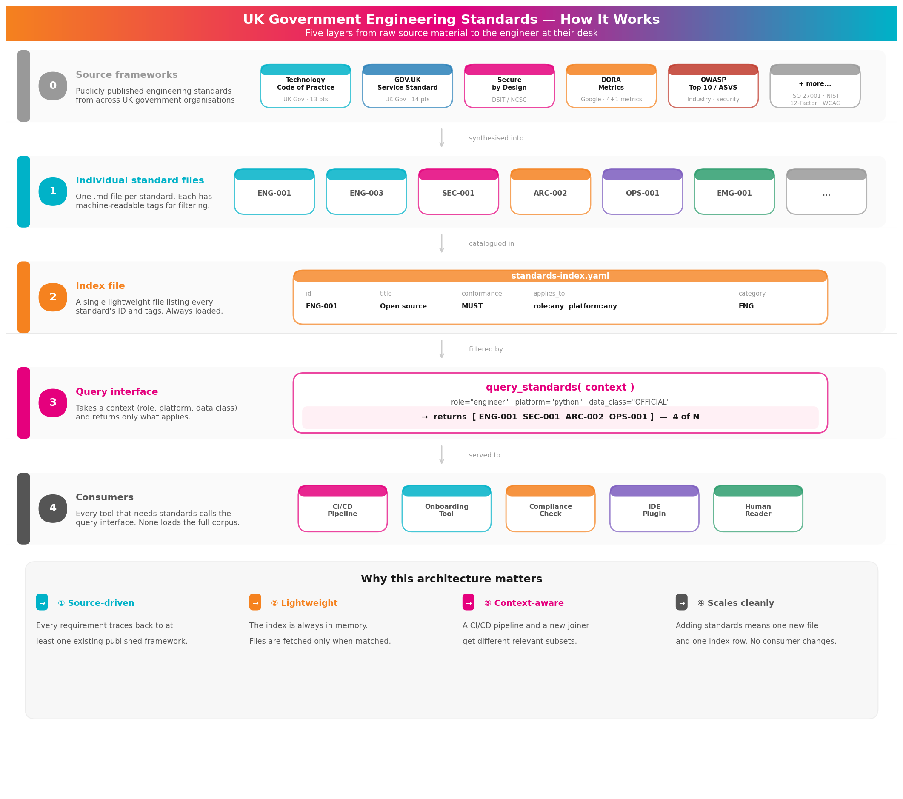

# UK Government Engineering Standards

Machine-readable, context-aware engineering standards for UK Government digital services. 33 standards across 7 categories, queryable by role, platform, and enforcement type.

> **Status: MVP / Draft** — not yet adopted by teams. Being developed in the open for feedback.



## Quick start

### 1. Install the VS Code extension (instant feedback)

Download the `.vsix` from the [latest release](https://github.com/bv90dsit/Engineering_standards/releases/latest), then:

```bash
code --install-extension uk-gov-engineering-standards-0.1.0.vsix
```

You'll get inline warnings as you type — `http://` URLs, hardcoded secrets, missing LICENCE/CI/README. See the [extension docs](vscode-extension/README.md) for full details.

### 2. Add the CI check to your service (2 minutes)

Add `.github/workflows/standards.yml` to your repo:

```yaml
jobs:
  compliance:
    uses: bv90dsit/Engineering_standards/.github/workflows/compliance.yml@main
    with:
      role: engineer
      platform: python   # or java, node, any
```

Every PR now checks compliance automatically.

### 3. See what applies to you

```bash
git clone https://github.com/bv90dsit/Engineering_standards.git
cd Engineering_standards
pip install pyyaml

python scripts/onboarding.py --role engineer --platform python
```

This tells you which standards apply, how each is enforced, and what to do to comply. See [usage by role](docs/usage-by-role.md) for detailed workflows per role.

## What's in the box

| Layer | What | Status |
|-------|------|--------|
| Source frameworks | GDS Service Standard, NCSC, DORA, OWASP, WCAG, etc. | ✅ Referenced |
| 33 standard files | `standards/*.md` — one per standard with frontmatter | ✅ Complete |
| Index | `standards-index.yaml` — lightweight, always loaded | ✅ Complete |
| Query library | `standards_lib/` — importable Python package + CLI | ✅ Built |
| CI/CD checker | `scripts/check_compliance.py` — automated + manual flags | ✅ Built |
| Reusable GitHub Action | `.github/workflows/compliance.yml` | ✅ Built |
| Onboarding tool | `scripts/onboarding.py` | ✅ Built |
| VS Code extension | `vscode-extension/` — inline warnings as you type | ✅ Built |
| Compliance dashboard | Web view: services × standards matrix | 🔲 Planned |

## Adding a new standard

1. Create `standards/{ID}.md` with YAML frontmatter
2. Add one row to `standards-index.yaml`
3. Done. No consumer changes needed.

## Categories

| Prefix | Category | Count |
|--------|----------|-------|
| ENG | Engineering practice | 6 |
| SEC | Security | 7 |
| ARC | Architecture | 5 |
| OPS | Operations & reliability | 5 |
| DAT | Data | 4 |
| ACC | Accessibility | 2 |
| EMG | Emerging technology (AI) | 4 |

## Conformance and enforcement

Each standard has a **conformance level** (how mandatory) and an **enforcement mechanism** (how it's checked):

| Conformance | Meaning |
|-------------|---------|
| **MUST** (18) | Non-negotiable. Exceptions require a documented ADR. |
| **SHOULD** (14) | Expected unless there is a justified reason to deviate. |
| **COULD** (1) | Recommended good practice. |

| Enforcement | When | Example standards |
|-------------|------|-------------------|
| **automated** | Every PR via CI/CD | ENG-001, ENG-003, SEC-002, SEC-003 |
| **peer-review** | During code review | SEC-004, ARC-004, EMG-001 |
| **periodic-audit** | Service assessment / quarterly | SEC-005, SEC-007, OPS-001, DAT-001 |
| **ways-of-working** | Team charter / runbooks | OPS-003, ENG-005, ENG-006 |

Standards can have multiple enforcement types. The compliance checker automates what it can and flags the rest for manual review.

## Source frameworks

Every standard traces back to at least one published framework. Key sources include:

- [Technology Code of Practice](https://www.gov.uk/guidance/the-technology-code-of-practice) — UK Gov
- [GOV.UK Service Standard](https://www.gov.uk/service-manual/service-standard) — UK Gov
- [NCSC Secure by Design](https://www.ncsc.gov.uk/collection/developers-collection) — DSIT/NCSC
- [DORA Metrics](https://dora.dev/) — Google
- [OWASP Top 10 / ASVS](https://owasp.org/www-project-application-security-verification-standard/) — Industry
- [WCAG 2.2](https://www.w3.org/TR/WCAG22/) — W3C

See [docs/sources.md](docs/sources.md) for the full list of all sources, grouped by authority, with which standards each one informs.

## Governance

**Current (MVP):** Direct pushes to `main` allowed. Force pushes and branch deletions blocked.

**When teams adopt:**

| Setting | Now | Future |
|---------|-----|--------|
| PR required | No | Yes |
| Approvals | 0 | 2 |
| CI checks | No | YAML lint + index consistency |
| CODEOWNERS | None | Per-category owners |

Even during MVP: open an issue, create a PR (even if self-merging), give 24 hours for async comment.
