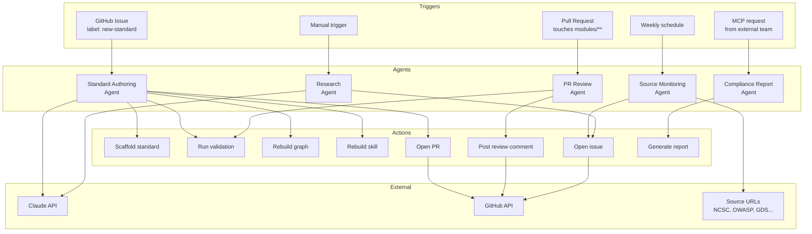
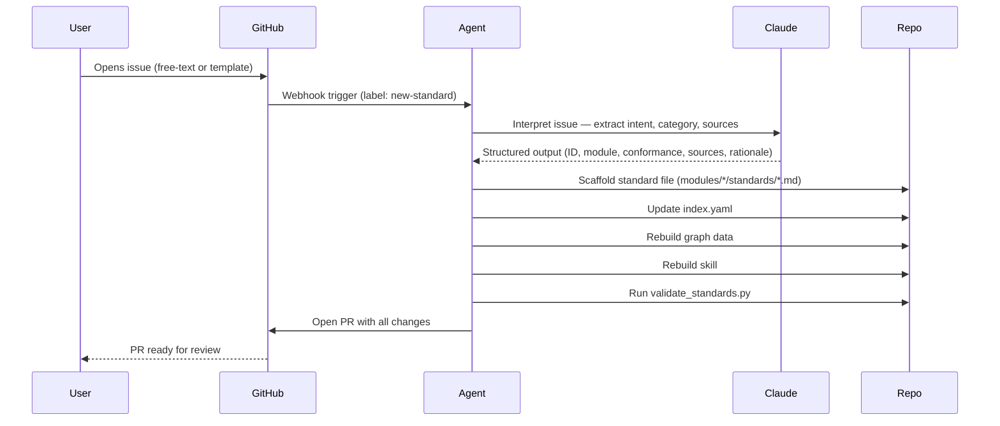
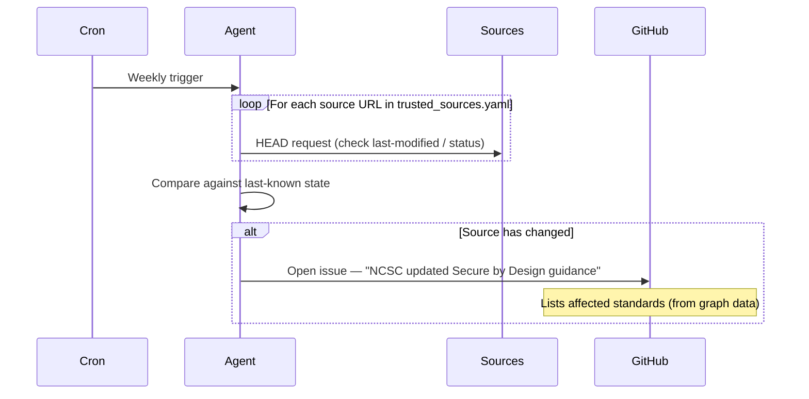
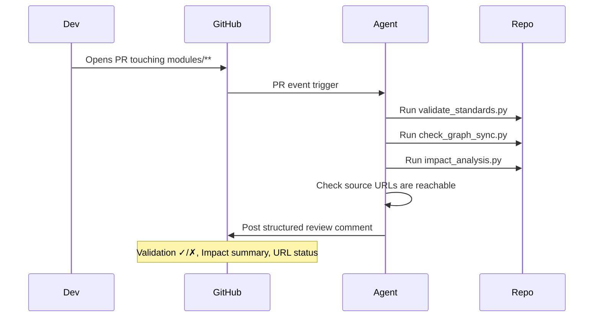
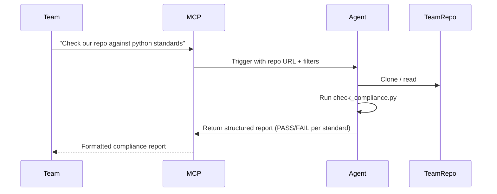
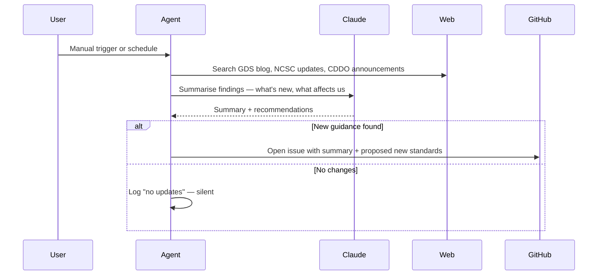

# Agentic Workflows — Architecture

Potential AI-powered automation for this repo. Each workflow is independent — they can be adopted incrementally.

## Overview

## Workflow Details

### 1. Standard Authoring Agent (highest value)

**Requires:** `ANTHROPIC_API_KEY` repo secret

**Eliminates:** Manual multi-file creation, graph drift, forgotten index updates

---

### 2. Source Monitoring Agent

**Requires:** No API key (just HTTP requests + GitHub token)

**Eliminates:** Stale standards based on outdated source material

---

### 3. PR Review Agent

**Requires:** No API key (script-based checks + GitHub token)

**Eliminates:** Missed validation in review, manual impact assessment

---

### 4. Compliance Report Agent

**Requires:** MCP server running, access to target repo

**Eliminates:** Manual compliance checks, teams guessing which standards apply

---

### 5. Cross-Government Research Agent

**Requires:** `ANTHROPIC_API_KEY`, web access

**Eliminates:** Missing new government guidance, reactive rather than proactive updates

---

## Dependencies

| Workflow | GitHub Token | Anthropic API Key | Web Access | MCP Server |
|----------|:---:|:---:|:---:|:---:|
| 1. Standard Authoring | Yes | Yes | No | No |
| 2. Source Monitoring | Yes | No | Yes | No |
| 3. PR Review | Yes | No | No | No |
| 4. Compliance Report | No | No | No | Yes |
| 5. Research | Yes | Yes | Yes | No |

## Recommended adoption order

1. **PR Review Agent** — lowest barrier (no API key), immediate value, catches what CI misses
2. **Standard Authoring Agent** — highest value, needs API key
3. **Source Monitoring Agent** — fire-and-forget, catches staleness
4. **Compliance Report Agent** — serves other teams, depends on MCP adoption
5. **Research Agent** — nice-to-have, highest complexity
